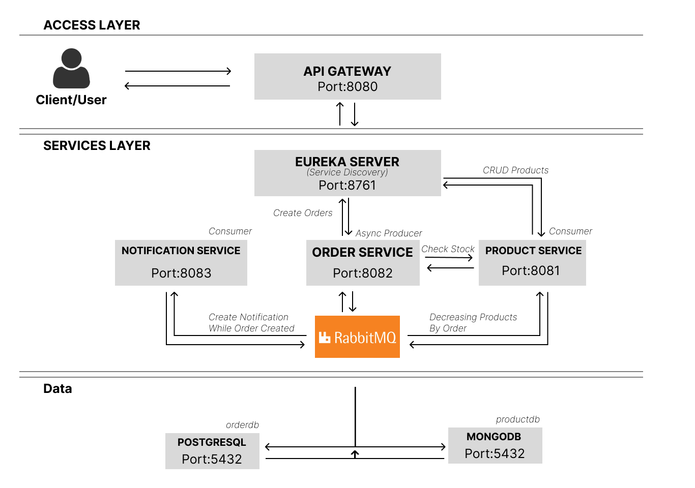

# Ecommerce Product Management, Order & Notification Integration

## Tech Stack

- Java 21
- Spring Boot 3
- Poliglot Persistence: PostgreSQL (Relational) & MongoDB (NoSQL)
- Docker & Docker Compose
- Eureka Server
- RabbitMQ

## Testing

- git clone https://github.com/zaidnshr1/Ecommerce-Microservices.git
- Run: docker-compose up -d --build
- POST  `/api/products` Create Produts
- GET `/api/products/` Get All Products
- GET `/api/products/{productID}` Get spesific Product
- PUT `/api/products/{productID}` Edit Product
- DEWLETE `/api/products/{productID}` Delete Product
- POST `/api/orders` to Order Items

## Overview

